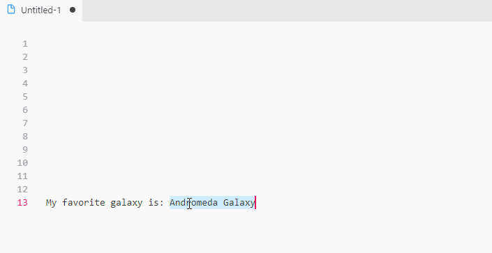

# Clipboard Manager

Keep a history of your copied and cut items and re-paste, without override the `Ctrl+C` and `Ctrl+V` keyboard shortcuts.

To pick a copied item, only run `Ctrl+Shift+V`

## Features

1. Save history of all copied and cut items
1. Can check copied items outside the VSCode (`"clipboard-manager-with-cycling.onlyWindowFocused": false`)
1. Paste from history (`Ctrl+Shift+V` => Pick and Paste)
1. Preview the paste
1. Snippets to paste (Ex. `clip01, clip02, ...`)
1. Remove selected item from history
1. Clear all history
1. Open copy location
1. Double click in history view to paste

## Extension Settings

This extension contributes the following settings (default values):

<!--begin-settings-->
```js
{
  // Avoid duplicate clips in the list
  "clipboard-manager-with-cycling.avoidDuplicates": true,

  // Time in milliseconds to check changes in clipboard. Set zero to disable.
  "clipboard-manager-with-cycling.checkInterval": 500,

  // Maximum clipboard size in bytes.
  "clipboard-manager-with-cycling.maxClipboardSize": 1000000,

  // Maximum number of clips to save in clipboard
  "clipboard-manager-with-cycling.maxClips": 100,

  // Move used clip to top in the list
  "clipboard-manager-with-cycling.moveToTop": true,

  // Get clips only from VSCode
  "clipboard-manager-with-cycling.onlyWindowFocused": true,

  // View a preview while you are choosing the clip
  "clipboard-manager-with-cycling.preview": true,

  // Set location to save the clipboard file, set false to disable
  "clipboard-manager-with-cycling.saveTo": null,

  // Enable completion snippets
  "clipboard-manager-with-cycling.snippet.enabled": true,

  // Maximum number of clips to suggests in snippets (Zero for all)
  "clipboard-manager-with-cycling.snippet.max": 10,

  // Default prefix for snippets completion (clip1, clip2, ...)
  "clipboard-manager-with-cycling.snippet.prefix": "clip"
}
```
<!--end-settings-->

## Examples

Copy to history:


Pick and Paste:


# Donation
* Donation is as per your goodwill to support my development.
* If you are interested in my future developments, i would really appreciate a small donation to support this project.
<table border="0">
 <tr>
    <td align="center">
    PayPal <br>
        <br>
       <a href="https://www.paypal.com/donate?hosted_button_id=5KHYY5ZDTNDSY">
          
       </a>
    </td>
    <td align="center">
       Pix (Brazil) <br>
        <br>
       28571c52-8b9b-416c-a18f-8e5246060881
    </td>
 </tr>
</table>
